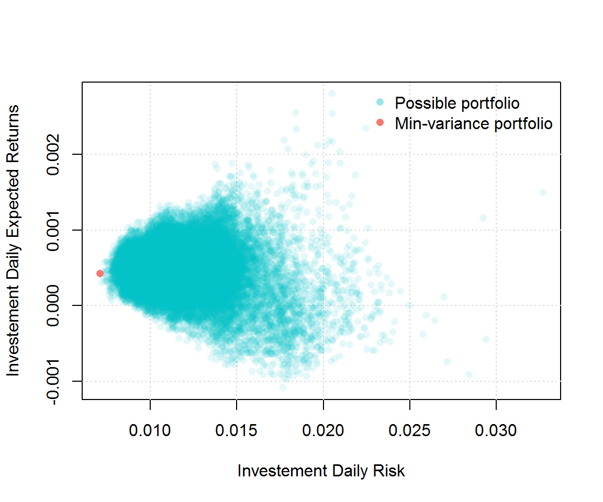

# Exercise 2


## Objectives :full_moon_with_face: 
- Learn how program effectively using if/else and iterations statements;
- Become familiar with using data frame objects and other data structures;
- Use some matrix calculus in R.


## Content :rocket: 


### Problem 1: Are you a power?
Write a program that prints the numbers from 1 to 100, but with the specific requirement:

- if the number is a full square of another number $a$, print `a^2`;
- if the number is a full cube of another number $b$, print `b^3`;
- if the number is a full square of another number $a$ **and** a full cube of another number $b$, print `a^2, b^3`.

An example of the output would be:

```{r}
"1^2, 1^3" "2" "3" "2^2" "5" "6" "7" "2^3" "3^2" "10" "11" "12" "13" "14" "15" "4^2" "17" "18", ...
```


### Problem 1: solution

Below is a possible solution for "Are you a power?". The `%in%` returns `TRUE` if the element belongs to the set, or `FALSE` otherwise.


```{r}
numbers <- character(100)
squares <- (1:10)^2
cubes <- (1:4)^3
for (k in 1 : length(numbers)) {
  if (k %in% squares && k %in% cubes) {
    numbers[k] <- paste0(which(squares == k), "^2, ", which(cubes == k), "^3")
  } else if (k %in% squares) {
    numbers[k] <- paste0(which(squares == k), "^2")
  } else if (k %in% cubes) {
    numbers[k] <- paste0(which(cubes == k), "^3")
  } else {
    numbers[k] <- k
  }
}
numbers
```


### Problem 2: Stock price and European call option

Let a stock price at time $t$ be $S(t) \equiv S_t$. Assume that $S(t)$ follows a Geometric Brownian Motion (GBM) given by:

$$\mathrm{d}S_t = r\,S_t  + \sigma \, S_t \, \mathrm{d}W_t, \quad 0 < t < 1,$$

where $S(0) = 1$, $r$ is a percentage drift, $\sigma$ is a percentage volatility, and $W_t$ is a Brownian motion.

To simulate from this continuous time series model one can use the Euler-Maruyama discretisation method with a constant temporal step $\tau$:

$$S_{m+1} = S_m + r\,S_m\,\tau + \sigma\,S_m\,\Delta W_m, \quad S_0 = 1,$$

where $\Delta W_m$ are i.i.d. centered normally distributed random variables with variance $\tau$, $m = 0, 1, 2, \ldots, N_t - 1$, $N_t = \text{ceiling}(1/\tau) + 1$ is the number of temporal steps at which the values $S_m$ are calculated (including $0$ and the first temporal step that exceeds $1$, if necessary).

A European call option with the strike price $K$ can be expressed as

$$Y = \exp(-r) \cdot \max\\{0; S(1) - K\\}.$$

The value of $Y$ can be approximated using a Monte-Carlo method: consider $N$ Euler-Maruyama simulations of the paths $S(t)$; for each simulation $n = 1, 2, \ldots, N$ calculate $Y_{n}$ using the above mentioned formula; eventually, approximate the value of $Y$ by taking the mean $\bar{Y}$.

For the following parameters

|Parameter|Value|
|---|---|
|$r$|0.05|
|$\sigma$|0.2|
|$\tau$|0.001|
|$K$|1|
|$N$|500|

- **(a)** Simulate $N$ paths of the stock price $S(t)$ using the Euler-Maruyama method. Plot some of these paths and comment on them. Do you think this model reflect what you could observe on the stock market? What features seem striking?

- **(b)** Calculate $N$ European call option prices $Y_n$, $n = 1, 2, \ldots, N$ and plot the average option price `Y_bar = mean(Y_n)`. Is it what you were expecting?

- **\(c)** Find and plot with a green color the path $S(t)$ versus the time $t$, which led to the highest value of the option price, i.e. the path $S(t)$ corresponding to $\max(Y_n)$;

- **(d)** On the same graph plot the path $S(t)$, which led to the lowest value of the option price, i.e. the path $S(t)$ corresponding to $\min(Y_n)$;

- **(e)** Finally, on the same graph plot the path $S(t)$, which led to the value $Y_k$ that is the closest to the estimate $\bar{Y}$, i.e. the path $S(t)$ corresponding to $\min(|Y_n - \bar{Y}|)$.


### Problem 2: solution

- **(a)** First we initialise all the given parameters:

```{r}
S_0 <- 1
r = .05
sigma <- .2
Time <- 1
K <- 1
tau <- 0.001
N <- 500
```

Then we calculate the number of temporal steps at which we shall calculate the values of $S(t)$. 

```{r}
Nt <- ceiling(Time / tau) + 1
t <- seq(0, (Nt - 1)*tau, by = tau)
```

Note that for the given $\tau = 0.001$ the final temporal step $t = (N_t - 1) \cdot \tau = 1$. If $\tau$ was not "so nice", the algorithm above would also include the first point that exceeds $t = 1$.

The results of simulations will be stored in a matrix

```{r}
S_sim <- matrix(nrow = N, ncol = Nt)
```

Finally, start the simulations. For the code reproducibility, use `set.seed()`.

```{r}
set.seed(123)
for (n in 1 : N) {
  dW = rnorm(Nt - 1, 0, sqrt(tau))
  S <- numeric(Nt)
  S[1] <- S_0
  for (k in 2 : Nt) {
    # browser()
    S[k] = S[k-1] + r*S[k-1]*tau + sigma*S[k-1]*dW[k-1]
  }
  S_sim[n, ] <- S
}
```

- **(b)** We simply extract the last column of `S_sim[, Nt]`, which contains all $N$ simulated values of $S(1)$, and use it to calculate the European call options $Y_n$:

```{r}
Y_n <- exp(-r) * pmax(0, S_sim[, Nt] - K)
Y_bar <-  mean(Y_n)
Y_bar
```

- **(c)**, **(d)** and **(e)** We find the indexes where `Y_n` is taking its maximal and minimal values. There are multiple instances when `Y_n` is equal to $0$. Therefore, we take a random index that correspond to the zeroth `Y_n`. To find the value `Y_mean_ind` that is the closest to the mean `Y_bar`, we take the the index of a `Y_n`, which is the closest to the average value `Y_bar`. The remainder of the solution is as follows:

```{r}
Y_min_ind <- which(Y_n == min(Y_n))
Y_max_ind <- which(Y_n == max(Y_n))
if (length(Y_min_ind) > 1) {
  Y_min_ind <- sample(Y_min_ind, 1)
}
Y_mean_ind <- which.min(abs(Y_n - Y_bar))


plot(
  t, S_sim[Y_max_ind, ],
  type = "l", col = "green",
  ylim = c(.5, 2), ylab = "S",
  main = "Simulated paths of S"
)
lines(t, S_sim[Y_min_ind, ], col = "red")
lines(t, S_sim[Y_mean_ind, ], col = "black")
legend(
  x = 0, y = 2,
  legend = c("Max Y", "Min Y", "Avg Y"),
  col = c("green", "red", "black"),
  lty = 1, cex = 1
)
```


### Problem 3: portfolio construction
Suppose that you are working in an investment firm company as a quantitative analyst. Your boss gives you the task of creating a portfolio for one of your client. The client wants to find the portfolio with the smallest variance that satisfies the following constraints:

- Invest exactly $1,000,000.
- Invest in exactly two stocks of the S&P500 index.

Therefore, your boss requires that you compute all possible portfolios that satisfy the client's constraints, represent them graphically as (for example) in the graph below and find the weight of the best (i.e. minimum variance) portfolio.



Using the dataset `stocks.rds`, fulfill the task. Hint: you may want to use the formulas and code [here](https://smac-group.github.io/ds/section-data.html#section-example-portfolio-optimization) for constructing the portfolios.

### Problem 4: solving a maze
Follow instructions and exercise 4 provided [here](https://intro-to-ds.netlify.app/chapter2).
